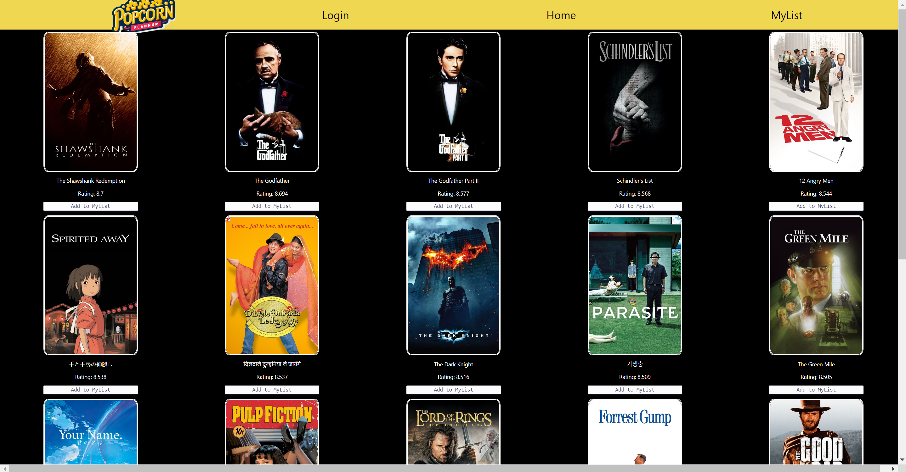

# PopcornPlanner

PopcornPlanner is an app that allow users to view movies and add movies they are interested in watching to a list.

# Screenshots

**Home Page**



# Technologies Used

HTML, CSS, Bootstrap, Javascript, ReactJS, Docker, Postman, Airtable, API (https://www.themoviedb.org/settings/api)

# Getting Started

Access the project's public board [here](https://github.com/users/faris-wong/projects/1/views/1).

Install all the dependencies using npm command in terminal

```
npm i
```

```
npm i react-router-dom
```

# Next Steps

- Implement favourite list that is specific to user
