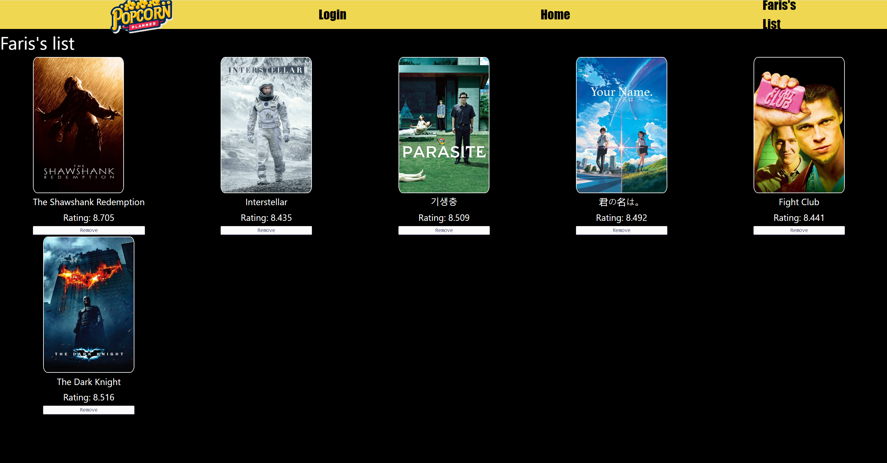

# PopcornPlanner

PopcornPlanner is inspired by my love for cinema but never having enough time to watch, I wanted to make an app that allows users to view movies' synopsis and add those they are interested in to a to-watch-list, with a click of a button.

# Screenshots

**Home Page**


**Favourites Page**



# Technologies Used

- HTML
- CSS
- Bootstrap
- Javascript
- ReactJS
- Airtable
- [TMDB API](https://www.themoviedb.org/settings/api)

# Getting Started

Access the project's public board [here](https://github.com/users/faris-wong/projects/1/views/1).

Install all the dependencies using npm command in terminal

```
npm i
```

```
npm i react-router-dom
```

# Environmental Variables

Variables stored in the `.env` file:

- VITE_SERVER
- VITE_API_READ_ACCESS_TOKEN
- VITE_API_KEY
- VITE_AIRTABLE_SERVER
- VITE_AIRTABLE_BEARER_TOKEN

# Next Steps

- Implement user specific favourite's list using a true log in with back-end validation
- Add search functionality to home page
